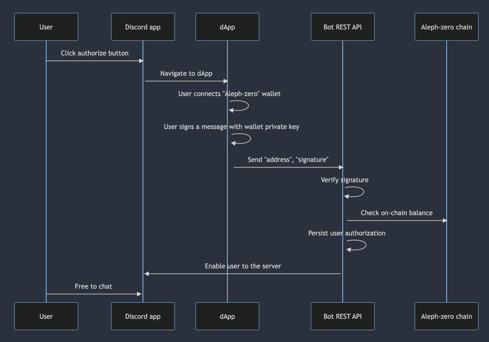

# Aleph-Zero GG

The Aleph-Zero GG is a multi-part application that allows users to join a Discord server based on their balance of a certain Aleph-Zero token.

## Table of Contents

- [Overview](#overview)
- [Use cases](#use-cases)
- [Solution in a nutshell](#solution-in-a-nutshell)
- [Usage](#usage)


## Use cases

This application is intended to support different use-case scenarios:

- **DAO governance servers**: Servers whose access is restricted to DAO participants holding a certain amount of governance tokens.
- **NFT communities**: NFT holders can join private community private chat rooms.
- **LP token holders**: Liquidity miners and other kind of investors can join private channels that are deeply focused on their interests.

## Solution in a nutshell

The project consists of three main components: a Discord bot written in Rust, a Rust web integration layer and a React frontend enabling users to connect their [Aleph Zero Signer](https://alephzero.org/signer) wallet and authenticate against the application.

The project is organized into three main components, each residing in its own directory:

1. **Discord Bot (Rust)**: The Discord bot is responsible for monitoring user interactions within the Discord server. When a user requests to join the server, the bot verifies their Aleph-Zero token balance and grants access if the criteria are met.

2. **Web Server (Rust)**: The web server serves as an integration layer between the Discord bot and the React frontend. It handles authentication, authorization, and communication with the Aleph-Zero blockchain to check token balances.

3. **React Frontend**: The React frontend provides a user-friendly interface for connecting the "Aleph Zero Signer" wallet, initiating the join server process, and displaying relevant information about the user's balance and server access status.



## Usage

```txt
# Create a .env file in the main directory
DISCORD_TOKEN=<TOKEN> # The discord token associated to your account
AUTH_ROLE_NAME=Authorization
```

Open 2 terminals
```bash
# Frontend
npm install
npm run dev
```

```bash
# Backend
cargo +nightly run
```
